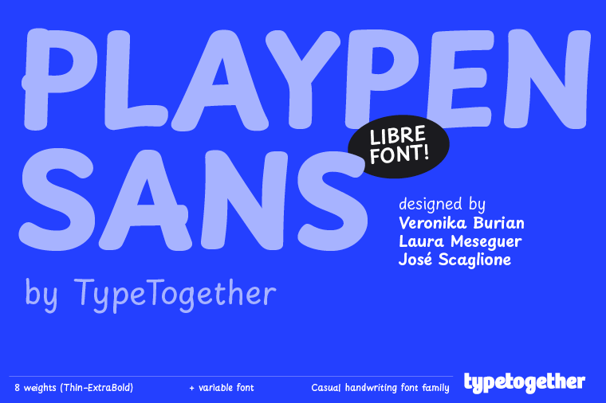
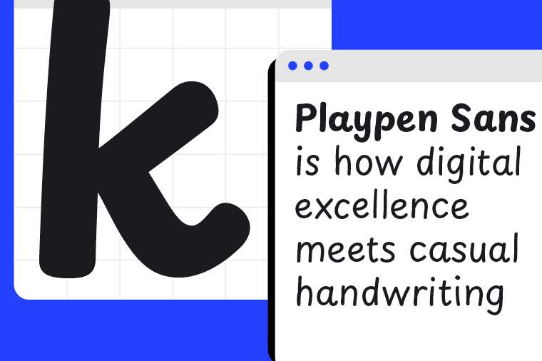

# Playpen Sans



Playpen Sans is one of the font families produced by [TypeTogether](https://type-together.com) after more than two years of primary research into handwriting education for Latin-based languages. It has seven automatic alternates for each character and a built-in shuffler that both ensures variation and avoids repetitive shapes in close proximity. This feature adds to the overall organic, spontaneous, and authentic feel of the handwritten style.

Playpen Sans is a variable font with a weight range from Thin to Extrabold, including support for over 150 Latin-based languages and a set of reward icons. The icons help parents and primary school teachers encourage and motivate young children, adding a playful and engaging element to the font family.



## How to access icons

Icons in Playpen Sans show up autmatically upon entering the keyword in between colons [:]. For example **:happy-sun:**. Find below a full list of icons and keywords.

| glyph Name           | uni | 1st | 2nd |
| --- | --- | --- | --- |
| sunFace              | 1F31E | `:happy-sun:` | `:happy:` |
| shootingStar         | 1F320 | `:shooting-star:` | `:star:` |
| birthdayCake         | 1F382 | `:birthday-cake:` | `:cake:` |
| artistPalette        | 1F3A8 | `:paint:` | `:color-palette:` |
| whiteUpBackhandIndex | 1F446 | `:attention-index:` | `:point-up:` |
| thumbsUpSign         | 1F44D | `:thumbs-up:` | `:good:` |
| thumbsDownSign       | 1F44E | `:thumbs-down:` | `:bad:` |
| openBook             | 1F4D6 | `:read:` | `:open-book:` |
| cheeringMegaphone    | 1F4E3 | `:announcement:` | `:attention:` |
| battery              | 1F50B | `:low-battery:` | `:incomplete:` |
| unicornFace          | 1F984 | `:unicorn:` | `:magic:` |
| jigsawPuzzlePiece    | 1F9E9 | `:puzzle:` |  |
| ringedPlanet         | 1FA90 | `:planet:` |  |
| pencil               | 270F  | `:pencil:` |  |
| checkmark            | 2713  | `:check-mark:` | `:correct:` |
| crossMark            | 274C  | `:cross-mark:` | `:incorrect:` |
| directHit            | 1F3AF | `:on-target:` | `:perfect:` |
| dinosaur             | 1F996 | `:dinosaur:` |  |
| homework             | None  | `:homework:` | `:study:` |
| paperplane           | None  | `:paper-plane:` |  |
| pencilbook           | None  | `:write:` |  |
| sportsMedal          | 1F3C5 | `:reward:` | `:prize:` |
| suninlove            | None  | `:loving-sun:` | `:love:` |
| sunpirate            | None  | `:pirate-sun:` | `:pirate:` |
| sunsad               | None  | `:sad-sun:` | `:sad:` |
| sunwink              | None  | `:wink-sun:` | `:wink:` |

## Build instructions

Playpen Sans fonts are built using [gftools](https://github.com/googlefonts/gftools) and [glyphspkg](https://github.com/jenskutilek/glyphspkg).

### Create a virtual environment

In order to build the fonts you will need to do the following steps:

```sh
# Move to the folder you want the repository in:
cd your/repositories/folder
# Clone the repository:
git clone https://github.com/TypeTogether/Playpen-Sans.git
# Move to the repository folder:
cd your/repositories/folder/Playpen-Sans
# Create a virtual environment named "env":
python3 -m venv env
# Activate your virtual environment
source env/bin/activate
# Upgrade pip before installing packages:
pip install --upgrade pip
# Install the needed Python packages:
pip install -r requirements.txt
```

Now you should be ready for building the fonts.

### Build fonts

#### Static fonts (otf, ttf, webfonts)

```sh
cd sources
sh build-static.sh
```

#### Variable font (ttf, woff2)

```sh
cd sources
sh build-var.sh
```

#### All at once (static + variable)

```sh
cd sources
sh build-all.sh
```


## Source file

The Playpen Sans source file is in Glyphs ".glyphspackage" format (which is more git-friendly than ".glyphs").

### Version 1.002
First release of Playpen Sans.

## License

Licensed under the [SIL Open Font License (v1.1)](https://scripts.sil.org/cms/scripts/page.php?site_id=nrsi&id=OFL)
