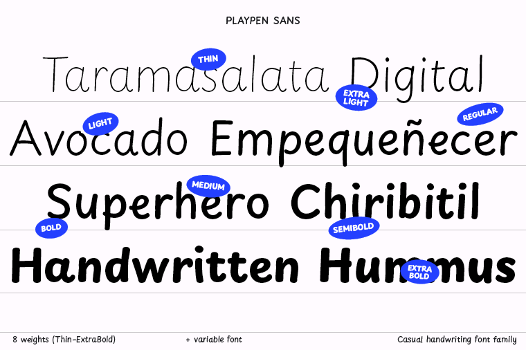

# Playpen Sans


Playpen Sans is one of the font families produced by [TypeTogether](https://type-together.com) after more than two years of primary research into handwriting education for Latin-based languages. It has seven automatic alternates for each character and a built-in shuffler that both ensures variation and avoids repetitive shapes in close proximity. This feature adds to the overall organic, spontaneous, and authentic feel of the handwritten style.

Playpen Sans is a variable font with a weight range from Thin to Extrabold, including support for over 150 Latin-based languages and a set of reward emojis. The emojis help parents and primary school teachers encourage and motivate young children, adding a playful and engaging element to the font family.


## How to access emojis

The emojis in Playpen Sans show up autmatically upon entering the standard emoji. For example to get the Sun wink, introduce the standard winking face. Find below a full list of the standard emojis for to get the ones included in the font.


| glyph name           | uni |  standard emoji  |
| --- | --- | --- |
| shootingStar         | 1F320 |  🌠  |
| birthdayCake         | 1F382 |  🎂  |
| artistPalette        | 1F3A8 |  🎨  |
| whiteUpBackhandIndex | 1F446 |  👆  |
| thumbsUpSign         | 1F44D |  👍  |
| thumbsDownSign       | 1F44E |  👎  |
| openBook             | 1F4D6 |  📖  |
| cheeringMegaphone    | 1F4E3 |  📣  |
| lowBattery           | 1FAAB |  🪫  |
| unicornFace          | 1F984 |  🦄  |
| jigsawPuzzlePiece    | 1F9E9 |  🧩  |
| ringedPlanet         | 1FA90 |  🪐  |
| pencil               | 270F  |  ✏  |
| checkmark            | 2713  |  ✓  |
| crossMark            | 274C  |  ❌  |
| directHit            | 1F3AF |  🎯  |
| dinosaur             | 1F996 |  🦖  |
| homework             | 1F3E0 |  🏠  |
| paperplane           | 2708  |  ✈︎  |
| pencilbook           | 270D  |  ✍️  |
| sportsMedal          | 1F3C5 |  🏅  |
| sunFace              | 1F31E |  🌞  |
| suninlove            | 1F60D |  😍  |
| sunpirate            | 2620  |  ☠️  |
| sunsad               | 2639  |  ☹️  |
| sunwink              | 1F609 |  😉  |

## Build instructions

Playpen Sans fonts are built using [gftools](https://github.com/googlefonts/gftools) and [glyphspkg](https://github.com/jenskutilek/glyphspkg).

### Create a virtual environment

In order to build the fonts you will need to do the following steps:

```sh
# Move to the folder you want the repository in:
cd your/repositories/folder
# Clone the repository:
git clone https://github.com/TypeTogether/Playpen-Sans.git
# Move to the repository folder:
cd your/repositories/folder/Playpen-Sans
# Create a virtual environment named "env":
python3 -m venv env
# Activate your virtual environment
source env/bin/activate
# Upgrade pip before installing packages:
pip install --upgrade pip
# Install the needed Python packages:
pip install -r requirements.txt
```

Now you should be ready for building the fonts.

### Build fonts

#### Static fonts (otf, ttf, webfonts)

```sh
cd sources
sh build-static.sh
```

#### Variable font (ttf, woff2)

```sh
cd sources
sh build-var.sh
```

#### All at once (static + variable)

```sh
cd sources
sh build-all.sh
```




## Source file

The Playpen Sans source file is in Glyphs ".glyphspackage" format (which is more git-friendly than ".glyphs").

### Version 1.002
First release of Playpen Sans.

## License

Licensed under the [SIL Open Font License (v1.1)](https://scripts.sil.org/cms/scripts/page.php?site_id=nrsi&id=OFL)
